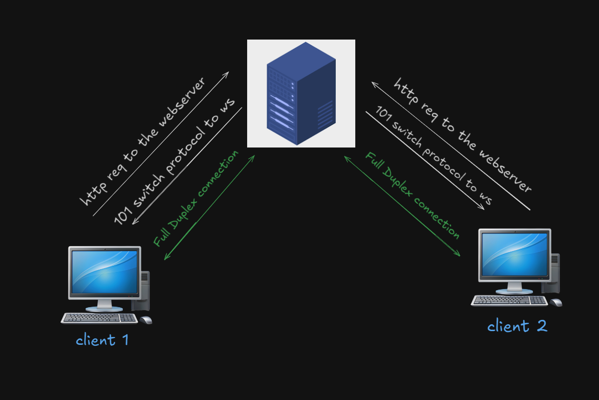
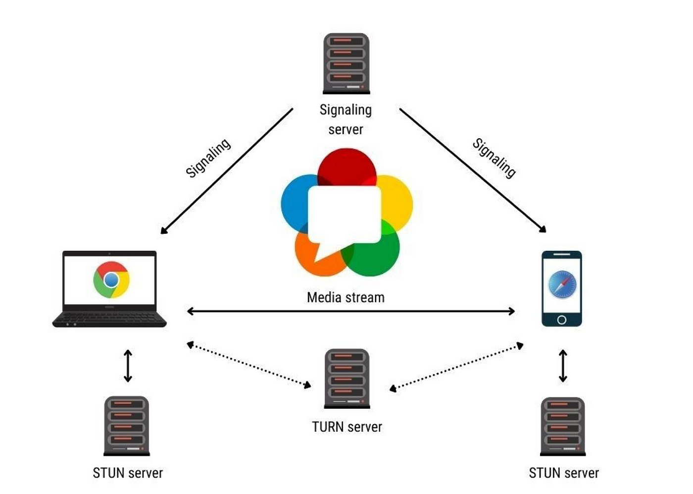
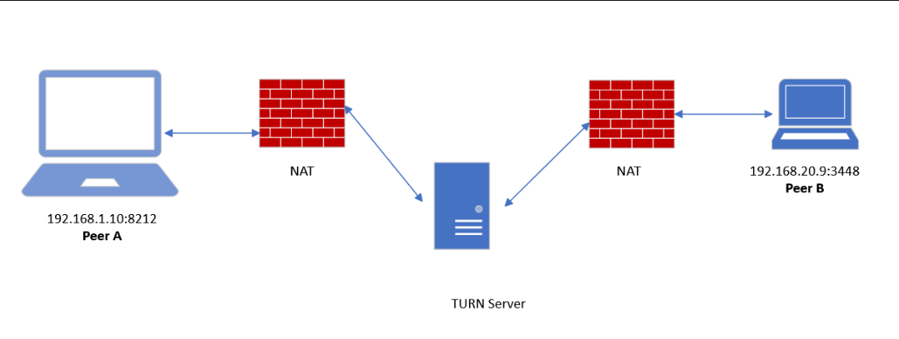

# LinkUp

# Problems Before Using Sockets

Before implementing sockets, developers relied on inefficient methods to maintain communication with the server:

## Polling

- Clients repeatedly send requests at fixed intervals to check for new data.
- Inefficient due to high server load, latency, and unnecessary network traffic.

## Long Polling

- Keeps the connection open until the server has new data, then closes and reopens it.
- Reduces some inefficiency but still causes overhead and latency.

## Server-Sent Events (SSE)

- Enables the server to push updates to the client over an open HTTP connection.
- Limited to one-way communication (server to client), making it unsuitable for interactive applications.

Sockets solve these issues by enabling real-time, bidirectional communication with minimal overhead.

# Problems Solved by WebSockets 

WebSockets were introduced to address these limitations by providing a full-duplex, bidirectional communication channel over a single TCP connection. Here’s how WebSockets solve these issues:

## 1. Bi-Directional Communication

- WebSockets allow both the client and server to send messages anytime without requiring client-initiated requests.
- Ideal for real-time applications like chat systems, gaming, and collaborative tools.

## 2. Low Latency

- Immediate message delivery with minimal overhead, reducing latency compared to polling or long polling.
- Suitable for time-sensitive applications like financial trading platforms or live sports updates.

## 3. Persistent Connection

- Uses a single, long-lived TCP connection, eliminating the need for repeated opening and closing of connections.
- Reduces overhead and improves performance.

## 4. Efficiency

- Traditional HTTP requests send headers and metadata with every request and response.
- WebSockets minimize this overhead with a lightweight, persistent connection, leading to efficient data transfer.

## 5. Scalability

- Reduces repeated connection setups and polling, allowing servers to handle more simultaneous connections.
- Enables real-time updates for large-scale applications like social media platforms and multiplayer games.

## Use Cases for WebSockets

WebSockets are widely used where real-time, low-latency communication is essential:

- **Chat applications:** Real-time messaging between users.
- **Online gaming:** Fast and responsive interactions between players.
- **Live data feeds:** Streaming stock prices, sports scores, or news updates.
- **Collaborative tools:** Multiple users working together on shared documents or drawings simultaneously.

# WebSocket and Networking

## Socket in Networking

A **socket** is an endpoint for sending and receiving data across a network.

## Socket.IO

**Socket.IO** is an npm library that builds on WebSockets to simplify real-time communication between clients and servers.

## WebSocket and TCP/IP

WebSockets rely on **TCP/IP** for data transmission:

- **TCP/IP Layer:** WebSockets operate at the application layer of the OSI model but use TCP at the transport layer, ensuring reliable and ordered data transmission.
- **Handshake:** WebSockets start with an HTTP handshake, upgrading to WebSocket protocol if supported. Once established, communication shifts from HTTP to WebSocket over the existing TCP connection.
- **Full-Duplex Communication:** WebSockets allow both client and server to exchange messages independently, enabling real-time applications like chat, live updates, and collaborative tools.

**Note:** WebSockets rely on TCP/IP to ensure efficient and reliable data transmission.

# WebSocket and Networking

## Socket in Networking

A **socket** is an endpoint for sending and receiving data across a network.

## Socket.IO

**Socket.IO** is an npm library that builds on WebSockets to simplify real-time communication between clients and servers.

## WebSocket and TCP/IP

WebSockets rely on **TCP/IP** for data transmission:

- **TCP/IP Layer:** WebSockets operate at the application layer of the OSI model but use TCP at the transport layer, ensuring reliable and ordered data transmission.
- **Handshake:** WebSockets start with an HTTP handshake, upgrading to WebSocket protocol if supported. Once established, communication shifts from HTTP to WebSocket over the existing TCP connection.
- **Full-Duplex Communication:** WebSockets allow both client and server to exchange messages independently, enabling real-time applications like chat, live updates, and collaborative tools.

**Note:** WebSockets rely on TCP/IP to ensure efficient and reliable data transmission.

# Setting Up WebSockets with Socket.IO

To use **Socket.IO**, it must be included on both the client and server to facilitate communication and upgrade the connection from HTTP to WebSockets.

## Client-Side

- In development, the **CDN** version of Socket.IO can be used to quickly integrate WebSockets into a client-side application.
- However, this is **not recommended** for production applications.
- In production, it is best to install the **Socket.IO client package** via npm to ensure stability and maintainability.

## Server-Side

- The **Socket.IO package** from npm is required for the server to manage WebSocket connections.
- Since **Node.js** comes with an HTTP module that handles requests and responses, it can also handle **TCP connections** at a low level.

## Using Express with WebSockets

- **Express.js** is a framework built on top of the HTTP module.
- While Express makes handling requests, responses, and middleware easy, it does **not** have built-in support for WebSocket upgrades.
- To integrate WebSockets with Express, we use the **http.Server wrapper** to extend the capabilities of Express and enable WebSocket communication.

### Production-Level WebSocket Setup

In a production environment, using WebSockets effectively involves:

1. **Using a dedicated WebSocket server:** Instead of relying solely on the Express server, WebSocket connections can be managed by a separate service optimized for handling persistent connections.
2. **Load balancing:** Since WebSockets maintain long-lived connections, load balancing is more complex. Solutions like sticky sessions or WebSocket-aware proxies (e.g., Nginx, HAProxy) are used.
3. **Using a message broker:** For large-scale applications, a message broker (e.g., Redis Pub/Sub, Kafka) is often used to distribute WebSocket events across multiple servers.
4. **Handling reconnections:** Implementing robust reconnection logic ensures clients can automatically reconnect if a WebSocket connection is lost.
5. **Security best practices:** WebSocket connections should be secured using **WSS (WebSocket Secure)**, and proper authentication mechanisms should be in place to prevent unauthorized access.

# **WebSockets: Enabling Real-Time Communication**

WebSockets provide a full-duplex communication channel between the client and server, allowing real-time data exchange without the overhead of repeated HTTP requests.

## **How WebSocket Connection Happens**

1. **Client-Side Initiation:**

   - The client creates a WebSocket connection using `const socket = io();`
   - This begins with a standard HTTP request to the server.

2. **Server-Side Readiness:**

   - The server listens for connection requests with `const io = socketIO(server);`
   - It waits for clients to connect.

3. **Handshake Phase:**

   - The client sends an HTTP request asking the server to upgrade to WebSocket.
   - The server agrees, completing the WebSocket handshake.

4. **Upgrading the Connection:**

   - The connection is upgraded from HTTP to WebSocket.
   - Now, data can flow in both directions continuously.

5. **Full-Duplex Communication:**
   - Unlike HTTP, where only the client initiates requests, WebSockets allow both the client and server to send messages at any time.
   - This makes it perfect for real-time applications like chat apps, online games, and WebRTC signaling.

## **How Communication Happens Between Clients**

- **Client A connects to the server:** The server keeps this connection open.
- **Client B connects to the server:** Now, the server has two active connections.
- **Message Exchange:** When Client A sends a message, the server relays it to Client B (or vice versa).

This process allows continuous, low-latency communication between clients without repeatedly making HTTP requests.

# Reference

- [MDN WebSockets Documentation](https://developer.mozilla.org/en-US/docs/Web/API/WebSocket)

# WebRTC (Web Real-Time Communication)

### Simulation of WebRTC Communication

#### Initial Setup

- **Server**: Listens for signaling messages from clients (like offers, answers, ICE candidates).
- **Client A**: Wants to start a video call.
- **Client B**: Waiting for an incoming call.

### Step-by-Step Flow

#### Step 1: Client A Initiates the Call

1. **Client A** clicks the "Start Video Call" button.
   - **Action**: Sends a message to the server indicating it wants to start a video call in a specific room.
2. **Server** receives the message and relays it to **Client B**.
   - **Action**: The server broadcasts the `incomingCall` message to Client B.

#### Step 2: Client B Receives the Incoming Call

1. **Client B** receives the `incomingCall` notification.
   - The UI shows an option to accept or reject the call.

#### Step 3: Client B Accepts the Call

1. **Client B** clicks the "Accept Call" button.
   - **Action**: Sends a message to the server to accept the call.
2. **Server** receives the acceptance message and informs **Client A**.
   - **Action**: Sends a `callAccepted` message to Client A.

#### Step 4: Both Clients Initialize Their Calls

1. **Client A** receives the `callAccepted` message and starts initializing the call.
2. **Client B** does the same upon receiving the acceptance message.

#### Step 5: Media Stream Setup

- **Both Clients** attempt to get access to their audio and video devices.
- **If successful**:
  - Each client sets their local video stream to show their video feed on the webpage.

#### Step 6: Client A Initiates the Offer

1. **Client A** creates an SDP offer with media details and sends it to the server.

#### Step 7: Server Relays Offer to Client B

1. **Server** receives the offer and relays it to **Client B**.

#### Step 8: Client B Receives the Offer

1. **Client B** processes the offer and sets it as the remote description.

#### Step 9: Client B Creates an Answer

1. **Client B** generates an SDP answer and sends it to the server.

#### Step 10: Server Relays Answer to Client A

1. **Server** sends the answer from **Client B** to **Client A**.

#### Step 11: Client A Receives the Answer

1. **Client A** processes the answer and sets it as the remote description.

#### Step 12: Exchanging ICE Candidates

- **Both Clients** start gathering and exchanging ICE candidates via the server.
- ICE candidates help establish the best connection path between peers.

#### Step 13: Connection Established

- **Once ICE candidates are exchanged**, both clients establish a peer-to-peer connection.
- They can now stream audio and video directly.

#### Step 14: Conducting the Video Call

- **Both Clients** can see and hear each other.
- **Real-time communication** takes place over the peer-to-peer connection.

#### Step 15: Ending the Call

1. **Either Client A or Client B** clicks the "Hang Up" button.
   - **Action**: Sends a message to the server, which informs the other client.
2. **Server** relays the hangup message.
3. **Both Clients** close their connections and stop media streams.

### NAT Issues in WebRTC Communication

- **Problem**: If both clients are behind restrictive NATs, direct communication may fail.
- **Solution**: Use STUN to discover public IP addresses, or TURN to relay media via a server.

### Summary of the Flow

- **Client A initiates the call**, the server relays messages, and both clients handle offers and answers to establish a connection.
- **ICE candidates** ensure a reliable connection, and once established, both clients communicate directly.
- The process of **hanging up** is also managed through signaling, ensuring both clients are aware when the call ends.

# Reference

- [MDN WebRTC Documentation](https://developer.mozilla.org/en-US/docs/Web/API/WebRTC_API)
